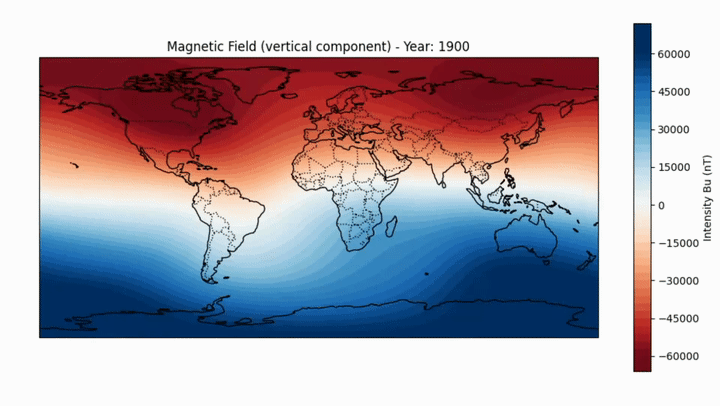
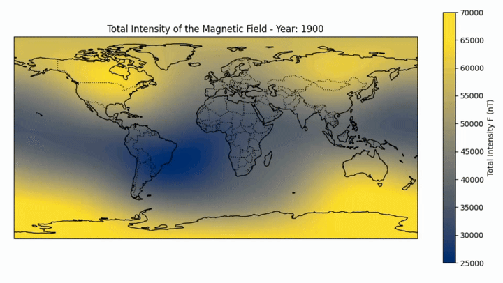

# SAA Geomagnetic Dynamics

## Description
This project aims to analyze the South Atlantic Anomaly (SAA) by developing a mechanism to visualize its geomagnetic behavior and inferring conclusions based on these observations. The complete analysis and code are available in the ipynb file.

## Objective
- To develop a Python-based tool for an accessible analysis of the South Atlantic Anomaly.
- To organize and derive conclusions by analyzing the data.
- To investigate the scientific background of the SAA through geophysical research.
- To compare experimental data with established theoretical findings, identifying the intersection between computational modeling and geophysics.
  
## Scientific Background
The South Atlantic Anomaly (SAA) is a region of reduced magnetic field intensity located over the South Atlantic. Due to the lower altitude of the inner Van Allen radiation belt in this area, the SAA poses significant risks to satellite and technological infrastructure. Although documented for nearly a century, the anomaly is estimated to have persisted for up to 900 years. Its intensity has been increasing, and it has exhibited a westward migration, driven by chaotic fluid dynamics in the Earth’s outer core.

## Methodology
The software was developed using Python, leveraging the ppigrf library to retrieve historical and predictive geomagnetic data. The data processing and visualization were performed using matplotlib, cartopy, and numpy within the Visual Studio Code environment. The analysis followed two distinct approaches:
- Vertical Component Analysis (Bu): Examining the geometry and inclination of the geomagnetic field lines.
- Total Magnetic Intensity Analysis (F): Evaluating the magnitude of the full magnetic vector.

These findings were cross-referenced with established scientific literature to ensure the reliability of the inferences documented in the "Results and Discussion" section.

## Results and Discussion
The analysis confirms that the South Atlantic Anomaly (SAA) is a persistent irregularity characterized by a localized reduction in magnetic energy density. The results demonstrate a direct correlation between the SAA and magnetic declination, evidenced by the misalignment between the geographic and magnetic poles. Furthermore, the anomaly's dynamics are heavily influenced by the Coriolis effect; by analyzing the chaotic fluid movements within the Earth's outer core, we observe how the Earth's rotation modulates these variations, significantly contributing to the westward drift of the anomaly.
A comparative study between the vertical component (Bu) and the Total Magnetic Intensity (F) reveals a notable spatial discrepancy. This suggests that the SAA is not merely a geometric inclination of field lines, but a comprehensive decrease in the Earth's magnetic shield. These results align with current geophysical research, demonstrating that analyzing the full magnetic vector is essential for accurately defining the anomaly's spatial extent.

## Visualization

Vertical Component of the Magnetic Field

Total Intensity of the Magnetic Field

## Technologies Used
- Python
  - ppifrg
  - matplotlib
  - numpy
  - cartopy
  - datetime
